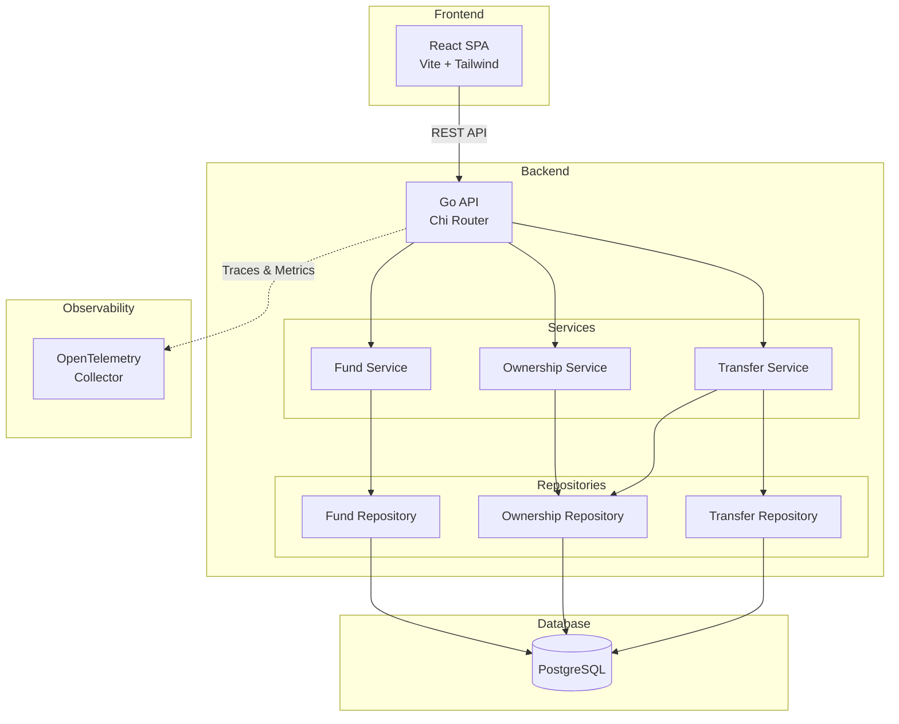
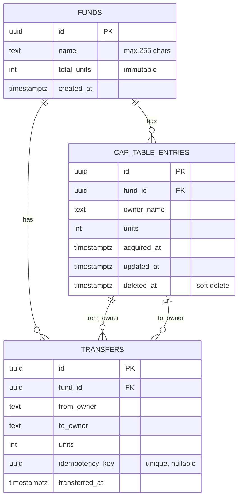
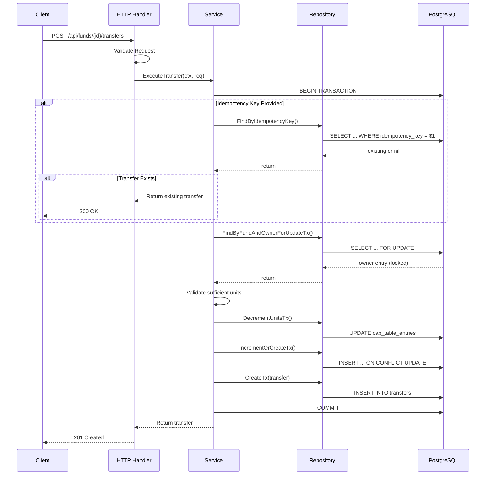
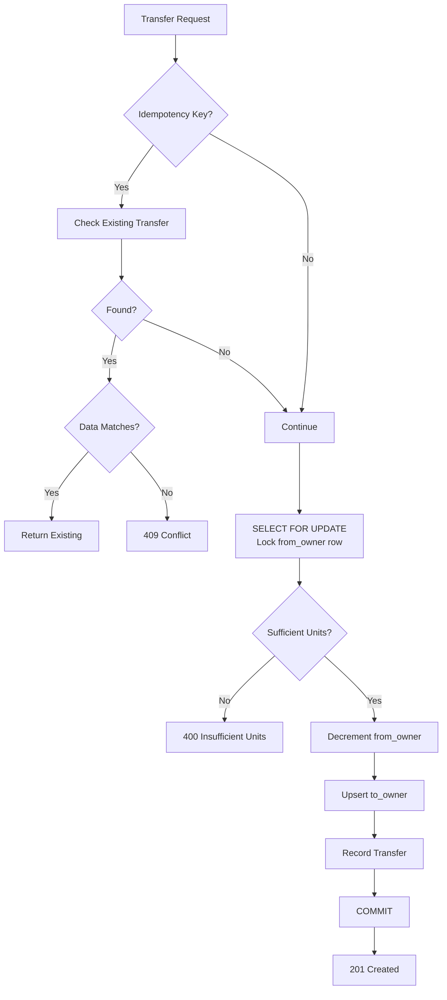
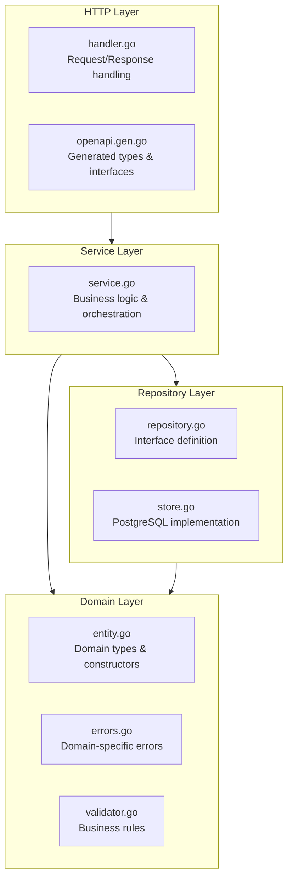
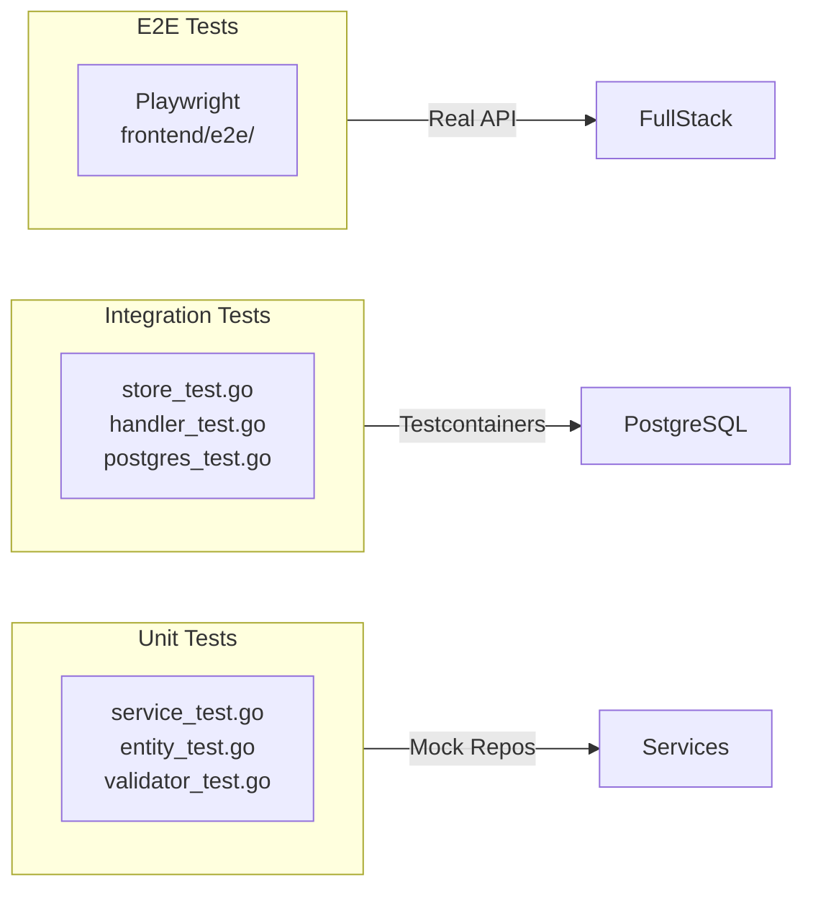
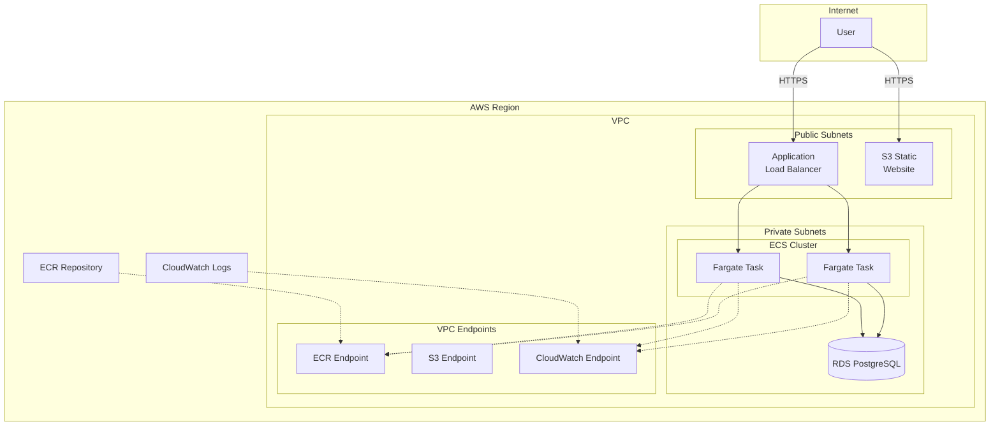

# Augment Fund Cap Table

A Go-based API for managing investment fund cap tables, tracking unit ownership and transfers between parties.

## Table of Contents

- [Overview](#overview)
- [Architecture](#architecture)
- [Code Patterns](#code-patterns)
- [Project Structure](#project-structure)
- [Environment Variables](#environment-variables)
- [Getting Started](#getting-started)
- [Development](#development)
- [Testing](#testing)
- [API Reference](#api-reference)
- [AWS Deployment](#aws-deployment)

## Overview

This system provides a complete solution for:

- Creating and managing investment funds with fixed ownership units
- Tracking ownership (cap table) with full audit history
- Executing transfers between owners with validation and idempotency support
- React frontend for fund management

### Key Invariants

- Total units across all cap table entries must equal fund's total units
- Transfers must not result in negative ownership
- Owner cannot transfer to themselves
- Transfer units must be positive

## Architecture

### System Overview



### Domain Model



### Request Flow



### Transfer Concurrency Control



## Code Patterns

### Layered Architecture

The codebase follows a clean layered architecture:



### Functional Options Pattern

Services use the functional options pattern for flexible dependency injection:

```go
// ServiceOption configures a Service
type ServiceOption func(*Service)

// WithRepository sets the transfer repository
func WithRepository(r Repository) ServiceOption {
    return func(s *Service) { s.repo = r }
}

// WithPool sets the database connection pool
func WithPool(p *pgxpool.Pool) ServiceOption {
    return func(s *Service) { s.pool = p }
}

// Usage
svc, err := transfer.NewService(
    transfer.WithRepository(transferStore),
    transfer.WithOwnershipRepository(ownershipStore),
    transfer.WithPool(pool),
)
```

### Repository Pattern

Each domain has a repository interface and PostgreSQL implementation:

```go
// Repository defines the interface for persistence operations
type Repository interface {
    Create(ctx context.Context, fund *Fund) error
    CreateTx(ctx context.Context, tx pgx.Tx, fund *Fund) error
    FindByID(ctx context.Context, id uuid.UUID) (*Fund, error)
    List(ctx context.Context, params ListParams) (*ListResult, error)
}

// Store implements Repository using PostgreSQL
type Store struct {
    pool *pgxpool.Pool
}
```

### Transaction Management

Services manage transactions for operations requiring atomicity:

```go
tx, err := s.pool.Begin(ctx)
if err != nil {
    return nil, fmt.Errorf("begin transaction: %w", err)
}
defer tx.Rollback(ctx)

// ... operations using tx ...

if err := tx.Commit(ctx); err != nil {
    return nil, fmt.Errorf("commit: %w", err)
}
```

### Domain Error Types

Each domain defines sentinel errors for type-safe error handling:

```go
var (
    ErrNotFound          = errors.New("fund not found")
    ErrInvalidFund       = errors.New("invalid fund")
    ErrPoolRequired      = errors.New("pool is required")
)

// NotFoundError wraps ErrNotFound with the fund ID
func NotFoundError(id uuid.UUID) error {
    return fmt.Errorf("%w: %s", ErrNotFound, id)
}

// Usage
if errors.Is(err, fund.ErrNotFound) {
    // Handle not found
}
```

### OpenAPI Code Generation

HTTP types and interfaces are generated from the OpenAPI spec:

```yaml
# api/oapi-codegen.yaml
package: http
output: internal/http/openapi.gen.go
generate:
  strict-server: true
  models: true
```

The handler implements the generated `StrictServerInterface`:

```go
type Handler struct {
    fundService      *fund.Service
    ownershipService *ownership.Service
    transferService  *transfer.Service
}

// Implements StrictServerInterface
func (h *Handler) CreateFund(ctx context.Context, req CreateFundRequestObject) (CreateFundResponseObject, error) {
    // Implementation
}
```

## Project Structure

```
.
├── api/
│   ├── openapi.yaml           # OpenAPI 3.0 specification
│   └── oapi-codegen.yaml      # Code generation config
├── cmd/
│   └── server/
│       └── main.go            # Application entrypoint
├── frontend/                   # React frontend (Vite + Tailwind)
│   ├── src/
│   │   ├── api/               # Generated API client
│   │   ├── components/        # React components
│   │   └── pages/             # Page components
│   └── e2e/                   # Playwright E2E tests
├── internal/
│   ├── config/                # Environment configuration
│   ├── fund/                  # Fund domain
│   │   ├── entity.go          # Fund type, NewFund constructor
│   │   ├── errors.go          # Domain errors
│   │   ├── repository.go      # Repository interface
│   │   ├── service.go         # Business logic
│   │   └── store.go           # PostgreSQL implementation
│   ├── http/                  # HTTP layer
│   │   ├── handler.go         # Request handlers
│   │   └── openapi.gen.go     # Generated code
│   ├── otel/                  # OpenTelemetry setup
│   │   ├── provider.go        # Tracer/Meter initialization
│   │   ├── middleware.go      # HTTP instrumentation
│   │   └── metrics.go         # Custom metrics
│   ├── ownership/             # Cap table domain
│   ├── postgres/              # Database utilities
│   │   ├── config.go          # Connection config
│   │   ├── pool.go            # Pool creation
│   │   ├── migrate.go         # Schema migrations
│   │   └── testcontainer.go   # Test infrastructure
│   ├── transfer/              # Transfer domain
│   └── validation/            # Shared validation
├── deploy/
│   └── terraform/             # AWS infrastructure
├── .golangci.yml              # Linter configuration
├── Dockerfile                 # Multi-stage build
├── Makefile                   # Build automation
└── docker-compose.yml         # Local development
```

## Environment Variables

### Required

| Variable | Description |
|----------|-------------|
| `DB_HOST` | PostgreSQL host |
| `DB_USER` | Database user |
| `DB_PASSWORD` | Database password |
| `DB_NAME` | Database name |

### Database Configuration

| Variable | Default | Description |
|----------|---------|-------------|
| `DB_PORT` | `5432` | PostgreSQL port |
| `DB_SSLMODE` | `require` | SSL mode (`disable`, `require`, `verify-full`) |
| `DB_MAX_CONNS` | `25` | Maximum pool connections |
| `DB_MIN_CONNS` | `5` | Minimum pool connections |
| `DB_MAX_CONN_LIFETIME` | `1h` | Maximum connection lifetime |
| `DB_MAX_CONN_IDLE_TIME` | `10m` | Maximum idle time before closing |

### Server Configuration

| Variable | Default | Description |
|----------|---------|-------------|
| `SERVER_HOST` | `0.0.0.0` | Server bind address |
| `SERVER_PORT` | `8080` | Server port |
| `CORS_ORIGINS` | `http://localhost:*` | Allowed CORS origins (comma-separated) |

### OpenTelemetry Configuration

| Variable | Default | Description |
|----------|---------|-------------|
| `OTEL_ENABLED` | `false` | Enable telemetry export |
| `OTEL_SERVICE_NAME` | `augment-fund-api` | Service name in traces |
| `OTEL_EXPORTER_OTLP_ENDPOINT` | `` | OTLP collector endpoint (e.g., `localhost:4317`) |
| `OTEL_TRACES_SAMPLER_ARG` | `0.1` | Trace sampling rate (0.0-1.0) |
| `VERSION` | `dev` | Application version |
| `ENVIRONMENT` | `development` | Deployment environment |

## Getting Started

### Prerequisites

- Go 1.24+
- PostgreSQL 16+
- Node.js 18+ (for frontend)
- Docker (for integration tests)

### Quick Start with Docker Compose

```bash
# Start PostgreSQL and the API
docker-compose up -d

# The API is available at http://localhost:8080
# PostgreSQL is available at localhost:5432
```

### Manual Setup

1. **Start PostgreSQL**:
   ```bash
   docker run -d --name augment-postgres \
     -e POSTGRES_USER=augment \
     -e POSTGRES_PASSWORD=secret \
     -e POSTGRES_DB=augment_fund \
     -p 5432:5432 \
     postgres:16
   ```

2. **Configure environment**:
   ```bash
   cp .env.example .env
   # Edit .env with your values
   source .env
   ```

3. **Run the server**:
   ```bash
   make run
   ```

4. **Start the frontend** (optional):
   ```bash
   cd frontend
   npm install
   npm run dev
   ```

### API Examples

**Create a fund**:
```bash
curl -X POST http://localhost:8080/api/funds \
  -H "Content-Type: application/json" \
  -d '{
    "name": "Growth Fund I",
    "totalUnits": 1000000,
    "initialOwner": "Founder LLC"
  }'
```

**Get cap table**:
```bash
curl http://localhost:8080/api/funds/{fundId}/cap-table
```

**Execute transfer**:
```bash
curl -X POST http://localhost:8080/api/funds/{fundId}/transfers \
  -H "Content-Type: application/json" \
  -d '{
    "fromOwner": "Founder LLC",
    "toOwner": "Investor A",
    "units": 100000,
    "idempotencyKey": "550e8400-e29b-41d4-a716-446655440000"
  }'
```

## Development

### Make Targets

```bash
make help          # Show all available targets

# Build
make build         # Build server binary
make docker-build  # Build Docker image

# Test & Quality
make test          # Run unit tests (fast, no Docker)
make test-integration  # Run integration tests (requires Docker)
make test-all      # Run all tests
make test-coverage # Run tests with coverage report
make lint          # Run golangci-lint

# Code Generation
make generate      # Generate all code
make generate-api  # Generate from OpenAPI spec

# Run
make run           # Build and run server
```

### Code Generation

The HTTP layer is generated from `api/openapi.yaml`:

```bash
# Regenerate after changing the OpenAPI spec
make generate-api
```

### Linting

The project uses golangci-lint with the following linters:

- `govet`, `errcheck`, `staticcheck`, `gosimple`
- `ineffassign`, `unused`, `misspell`
- `gofmt`, `goimports`, `gocritic`, `revive`

```bash
# Install golangci-lint
go install github.com/golangci/golangci-lint/cmd/golangci-lint@latest

# Run linter
make lint
```

## Testing

### Test Architecture



### Running Tests

```bash
# Unit tests only (fast, no Docker)
make test

# Integration tests (requires Docker for testcontainers)
make test-integration

# All tests with race detection
make test-all

# Coverage report
make test-coverage
open coverage.html
```

### Integration Tests

Integration tests use testcontainers-go to spin up PostgreSQL:

```go
//go:build integration

func TestMain(m *testing.M) {
    ctx := context.Background()
    testContainer, err = postgres.NewTestContainer(ctx)
    if err != nil {
        log.Fatalf("failed to create test container: %v", err)
    }
    code := m.Run()
    testContainer.Cleanup(ctx)
    os.Exit(code)
}
```

## API Reference

### Endpoints

| Method | Path | Description |
|--------|------|-------------|
| `GET` | `/api/funds` | List all funds (paginated) |
| `POST` | `/api/funds` | Create a new fund |
| `GET` | `/api/funds/{fundId}` | Get fund by ID |
| `GET` | `/api/funds/{fundId}/cap-table` | Get ownership table |
| `GET` | `/api/funds/{fundId}/transfers` | List transfers (paginated) |
| `POST` | `/api/funds/{fundId}/transfers` | Execute a transfer |
| `GET` | `/healthz` | Health check |

### Pagination

All list endpoints support:
- `limit` (default: 100, max: 1000)
- `offset` (default: 0)

### Error Codes

| Code | HTTP Status | Description |
|------|-------------|-------------|
| `INVALID_REQUEST` | 400 | Malformed request body |
| `INVALID_FUND` | 400 | Fund validation failed |
| `FUND_NOT_FOUND` | 404 | Fund does not exist |
| `OWNER_NOT_FOUND` | 400 | Owner not in cap table |
| `INSUFFICIENT_UNITS` | 400 | Sender lacks units |
| `SELF_TRANSFER` | 400 | Cannot transfer to self |
| `DUPLICATE_TRANSFER` | 409 | Idempotency key conflict |
| `INTERNAL_ERROR` | 500 | Server error |

### Idempotency

Transfer requests support an optional `idempotencyKey` (UUID):

- First request: Creates transfer, returns `201 Created`
- Duplicate with same data: Returns original transfer, `200 OK`
- Duplicate with different data: Returns `409 Conflict`

## AWS Deployment

### Infrastructure Overview



### Cost Estimate

| Component | Description | Cost (est.) |
|-----------|-------------|-------------|
| VPC Endpoints | ECR, S3, CloudWatch | ~$22/mo |
| RDS PostgreSQL | db.t3.micro, 20GB | ~$15/mo |
| ECS Fargate | 2 tasks (0.5 vCPU, 1GB) | ~$37/mo |
| ALB | Load Balancer + data | ~$20/mo |
| ECR | Container registry | ~$1/mo |
| S3 | Frontend hosting | ~$1/mo |
| CloudWatch | Logs & metrics | ~$1/mo |
| **Total** | | **~$97/mo** |

### Deployment Steps

1. **Configure Terraform**:
   ```bash
   cd deploy/terraform
   cp terraform.tfvars.example terraform.tfvars
   # Edit terraform.tfvars
   ```

2. **Deploy infrastructure**:
   ```bash
   terraform init
   terraform plan
   terraform apply
   ```

3. **Deploy application**:
   ```bash
   # Deploy API to ECS
   make deploy-api

   # Deploy frontend to S3
   make deploy-frontend

   # Or deploy both
   make deploy
   ```

### Terraform Outputs

| Output | Description |
|--------|-------------|
| `api_url` | API endpoint URL |
| `alb_dns_name` | ALB DNS for custom domain |
| `ecr_repository_url` | ECR URL for Docker push |
| `frontend_website_url` | Frontend S3 website URL |
| `rds_endpoint` | RDS connection endpoint |

### Destroy

```bash
# Disable deletion protection first
terraform apply -var="enable_deletion_protection=false"

# Destroy all resources
terraform destroy
```

## Tech Stack

| Layer | Technology |
|-------|------------|
| Language | Go 1.24 |
| Router | Chi v5 |
| Database | PostgreSQL 16 |
| DB Driver | pgx v5 |
| Migrations | golang-migrate |
| API Spec | OpenAPI 3.0 |
| Code Gen | oapi-codegen |
| Testing | testify, testcontainers-go |
| Linting | golangci-lint |
| Telemetry | OpenTelemetry |
| Frontend | React 18, Vite, Tailwind |
| Infrastructure | Terraform, AWS ECS Fargate |

## License

MIT
